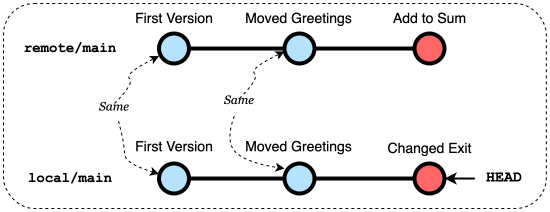
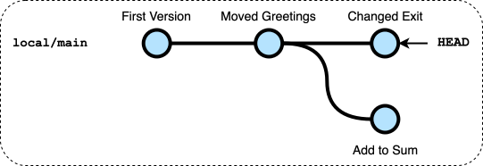
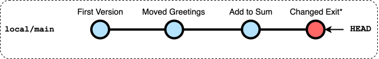
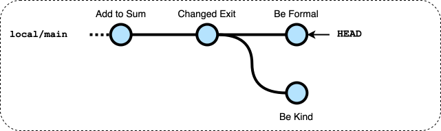
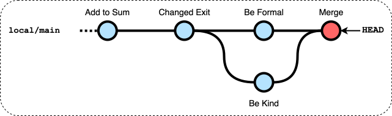
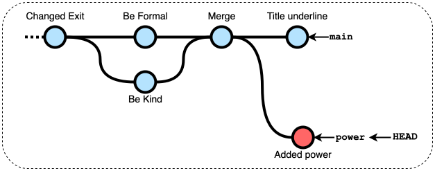

# Lab0 - Simple Calculator

## 1: Clona un repository utilizzando VSCode e git.

-  Su GitLab clicca il pulsante blu "`Codice`" e poi "`Clona con HTTPS`" per copiare il link al repository
    - se usate VSCode installato sul vostro computer potete cliccare su `Visual Studio Code (HTTPS)`
-  In VSCode clona il repository:
    - Nella schermata di benvenuto seleziona "`Clona repository Git...`" (Puoi usare Benvenuto o Inizia dal menu Aiuto per farla apparire)
    - Inserisci l'URL di questo repository: clicca il pulsante blu "`Codice`" e poi "`Clona con HTTPS`" per copiare il link
    - Seleziona una posizione nel file system: `/vscode/workspace` (preservato in caso di crash)
    - Inserisci il nome utente
    - Inserisci la password
    - Conferma che vuoi aprire il progetto

## 2 : Crea un'applicazione calcolatrice basata sulla console in Java

-  In VSCode completa il codice per l'applicazione
    - Deve eseguire le operazioni aritmetiche di base: addizione, sottrazione, moltiplicazione e divisione
    - La maggior parte del codice è già presente in `Calculator.java`, manca l'operazione di sottrazione

-  In VSCode, clicca sul pulsante Test sulla sinistra (icona della provetta)
    - Espandi i contenuti fino a trovare `TestCalculator.java`
    - Clicca sul pulsante di esecuzione accanto al file
    - Se un test fallisce leggi il messaggio e correggi il programma.

## 3 : Carica tutti i file sul repository remoto

-  In VSCode committa e invia il tuo codice
    - Clicca sul pulsante Controllo Sorgente (icona col grafo) per aprire il pannello di Controllo Sorgente
    - Vedrai i cambiamenti, inclusa `Calculator.java` con una **M** alla sua destra che indica che è stata modificata
    - Clicca su `Calculator.java` per aprire l'editor delle differenze
    - Aggiungi `Calculator.java` ai "Staged Changes" cliccando sul "`+`" accanto ad esso
    - Inserisci un messaggio di commit: "First Version" (sopra il pulsante "Commit")
    - Clicca sulla freccia in giù a fianco del pulsante "Commit" e poi seleziona `Commit & Push`

-  Su GitLab riapri (aggiorna) la pagina web con il repository remoto
    - vedrai in cima alla pagina un riquadro con l'ultimo commit che hai appena inviato
    - Clicca sul messaggio (es. "Prima versione") per vedere tutti i cambiamenti nel commit

## 4: Effettua una modifica utilizzando l'interfaccia web di GitLab

-  Su GitLab, nel repository, sposta la stampa di "Calcolatrice Semplice" prima del ciclo e committa la modifica
    - Torna alla pagina principale del progetto
    - Apri la cartella `src/calc`
    - Clicca sul file `Calculator.java`
    - Clicca sul pulsante blu `Edit` e seleziona `Edit single file` per iniziare a modificare il file
    - Apporta la modifica nell'area dell'editor: sposta la stampa di "Simple Calculator" prima del ciclo
    - Scrivi il messaggio di commit "Moved Greeting"
    - Clicca su `Commit`

## 5: Aggiorna il repository locale con un Pull

-  In VSCode sincronizza i cambiamenti:
    - clicca l'icona circolare "Synch Changes" nella barra inferiore a sinistra (vicino a "main")
    - Conferma l'operazione nel dialogo (`Ok`)
    - questa operazione aggiornerà i contenuti della copia di lavoro con i nuovi cambiamenti remoti
    - Controlla nelle finestre dell'editor che `Calculator.java` contenga ora il codice modificato

**Nota Bene**: questa è la procedura che dovresti seguire ogni volta prima di iniziare a lavorare, per assicurarti di avere nella tua working copy gli ultimi cambiamenti.

## 6: Esegui due modifiche contemporanee in GitLab e in VSCode

-  Su GitLab, cambia l'elemento del menu `"Add"` in `"Sum"` e fai il commit con il messaggio "*Add to Sum*"

-  In VSCode, cambia il valore della costante `EXIT` in `0` e aggiorna la stringa del prompt `(1-5)` che diventa `(0-4)` e fai il *Commit & Push* con il messaggio "*Changed exit*"
    - Riceverai un messaggio *"Can't push refs to remote. Try running "Pull" first to integrate your changes."*
    - clicca sul pulsante `Show Command Output` e si legge il messaggio

    ```
    ...
    hint: Updates were rejected because the remote contains work that you do
    hint: not have locally. This is usually caused by another repository pushing
    hint: to the same ref. You may want to first integrate the remote changes
    hint: (e.g., 'git pull ...') before pushing again.
    ```


## 7: Risolvi i commit divergenti con Rebase

I repository remoto e locale contengono i seguenti grafici di commit:



Il push è stato rifiutato perché il repository locale e quello remoto sono divergenti dopo il commit `("Moved Greeting")`.


-  In VSCode apri il pannello di Controllo Sorgente clicca sui "..." (puntini) e poi `Pull`
    - il comando ha generato un errore e l'output del comando ti dirà

    ```
    ...
    hint: You have divergent branches and need to specify how to reconcile them.
    hint: You can do so by running one of the following commands sometime before
    hint: your next pull:
    ...
    ```

    Il Pull (Fetch + Checkout) è fallito poiché due commit sono candidati a diventare HEAD del ramo principale, solo la parte Fetch è stata eseguita, l'attuale repository contiene due commit divergenti

    

    L'opzione più semplice per risolvere il problema è fare il "Rebase" dei commit locali dopo i commit remoti

-  In VSCode apri il pannello di Controllo Sorgente clicca sui "..." (puntini), `Pull, Push` e poi `Pull (Rebase)`

    Dopo il rebase, l'attuale repository contiene un unica sequenza di commit

    

    Ora hai 1 commit (il "Changed Exit") fatto il rebase dopo quello remoto ("Add to Sum").

-  In VSCode sincronizza i cambiamenti, in alternativa puoi:
    - Cliccare sul pulsante `Sync Changes` nel pannello di Controllo Sorgente
    - Cliccare sul pulsante di sincronizzazione (cerchio) nella barra inferiore

-  Su GitLab riapri (aggiorna) la pagina web con il repository remoto e verifica che tutti i cambiamenti siano ora presenti lì

## 8 Esegui due commit conflittuali contemporanei

-  Su GitLab, cambia i due `"Enter ... number"` in `"Plase, enter ... number"` e fai il commit con il messaggio "*Be kind*"

-  In VSCode, cambia i due `"Enter ... number"` in `"Enter ... operand"` e fai il commit e push con il messaggio "*Be formal*"

    - Riceverai un messaggio *"Can't push refs to remote. Try running "Pull" first to integrate your changes."*
    - clicca sul pulsante `Cancel` per ignorare il messaggio

-  Nel pannello di Controllo Sorgente di VSCode clicca su `Sync Changes` o (`Pull`)
    - il comando genera un errore come nel caso precedente a causa dei commit divergenti

Il repository locale contiene



## 9 Risolvi i commit conflittuali

-  In VSCode apri il pannello di Controllo Sorgente e clicca sui "..." (puntini), `Branch` e poi `Merge`
    
    - Ti sarà chiesto da quale ramo fare il merge, seleziona "origin/main" che è il ramo principale del repository remoto

    - Riceverai un messaggio "*Ci sono conflitti di merge. Risolvili prima di fare il commit.*"
        Questo è dovuto al fatto che le due modifiche sono in conflitto (sono sulle stesse linee) e git non è in grado di conciliarle automaticamente
    - Clicca su `Show Changes` per vedere i cambiamenti in conflitto
        - in questa finestra vedrai i conflitti, ad esempio:

        ```
        <<<<<<< HEAD
        "Enter ... operand"
        =======
        "Plase, enter ... number"
        >>>>>>> origin/main
        ```
        
        - potresti modificare il codice per combinare i cambiamenti e rimuovere i marcatori di conflitto (o usare i collegamenti sopra il conflitto) oppure puoi usare l'Editor di Merge

    - Clicca su `Resolve in Merge Editor` per eseguire un merge a tre vie dove vedi
        - il commit locale (attuale)
        - il commit remoto (in arrivo)
        - il risultato che inizialmente contiene i contenuti dell'antenato comune
        - Clicca su "`Accept Combination`", e modifica ulteriormente il codice se necessario
        - Clicca su `Complete Merge` per finalizzare la modifica del merge
        - ora un nuovo commit contenente i cambiamenti fusi con i conflitti risolti è pronto
    - Clicca su `Commit` nel pannello di Controllo Sorgente per completare il merge.

      Ora il repository locale contiene

      

    - Sincronizza i cambiamenti

-  Su GitLab, nel menu a sinistra seleziona `Code` e poi `Respository graph`
    - vedrai il grafico dei commit del repository

## 10 Sviluppa in rami separati

Ora implementa una nuova operazione (potenza) usando un ramo separato.

-  In VSCode apri il pannello di Controllo Sorgente e clicca sui "..." (puntini), `Branch` e poi `Crea Ramo...`
    - Inserisci il nome del nuovo ramo: `power`
    - Il nuovo ramo è selezionato, puoi vederlo nella barra inferiore

-  In VSCode modifica il codice per introdurre una nuova operazione `power`
    - aggiungi un nuovo codice costante `POW` per la nuova operazione,
    - aggiungi la stampa del corrispondente elemento del menu,
    - aggiungi un nuovo caso allo switch per gestire l'operazione,
    - aggiungi un nuovo metodo per eseguire l'operazione, puoi usare il metodo `Math.pow()` per eseguire l'operazione di elevazione a potenza.

-  Nel pannello di Test di VSCode riesegui il test per verificare che tutte le operazioni precedenti siano ancora funzionanti

-  Nel Controllo Sorgente di VSCode, fai il Commit con il messaggio "Added power"

-  Su GitLab, cambia il messaggio iniziale
    - Aggiungi una linea di `"=================="` sotto il messaggio iniziale
    - Fai il Commit con il messaggio "`Title underline`"

-  Nel Controllo Sorgente di VSCode, clicca su `Publish Branch...`
    - l'operazione ha successo poiché i commit divergenti appartengono a due rami distinti



## 11 Unisci nel ramo principale

-  In VSCode, clicca sul ramo *power* nella barra inferiore 
    - seleziona `main` per passare a quel ramo

-  Nel pannello di Controllo Sorgente di VSCode clicca su `Sync Changes` per tirare gli ultimi commit su GitLab

-  Nel pannello di Controllo Sorgente di VSCode clicca sui "..." (puntini), `Branch` e poi `Merge`
    - seleziona il ramo `power` in modo che venga unito a `main`
    - i cambiamenti non sono in conflitto quindi il merge viene eseguito automaticamente  
      Nota: in caso di cambiamenti in conflitto avresti dovuto eseguire la risoluzione come in [passaggio 9](#9-risolvi-i-commit-conflittuali)

-  Nel Controllo Sorgente di VSCode, Push al repository remoto (Sync Changes)

---

    
