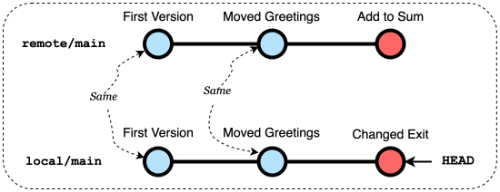
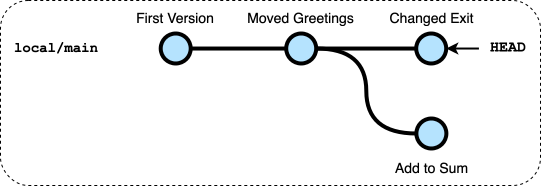
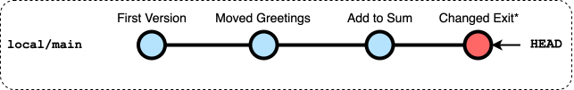
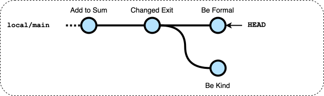
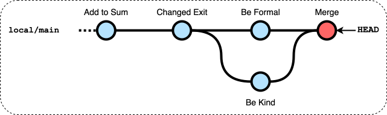
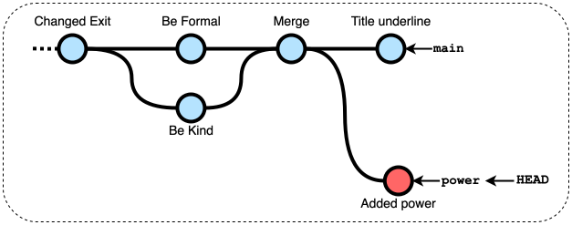

# Lab0 - Simple Calculator

## 1: Clone a repository using VSCode and git.

-  On GitLab click the blue "`Code`" button and then "`Clone with HTTPS`" to copy the link to the repository
    - if you are using VSCode installed on your computer you can click on `Visual Studio Code (HTTPS)`
-  In VSCode clone the repository:
    - In the welcome screen select "`Clone Git Repository...`" (You can use Welcome or Get Started in the Help menu to bring it on)
    - Enter the url of this repository: click the blue "`Code`" button and then "`Clone with HTTPS`" to copy the link
    - Select a location on the file system: `/vscode/workspace` (preserved in case of crash)
    - Enter username
    - Enter password
    - Confirm that you want to open the project

## 2 : Build a console-based calculator application in Java 

-  In VSCode complete the code for the application
    - It must perform basic arithmetic operations: addition, subtraction, multiplication, and division
    - Most the code is already present in `Calculator.java`, the subtraction operation is missing

-  In VSCode, click on the Testing button on the left (vial icon)
    - Expand the contents until you find `TestCalculator.java`
    - Click on the run button next to the file
    - If any test fails read the message and fix the program.


## 3 : Push all the files to the remote repository

-  In VSCode commit an push your code
    - Click the Source Control button (graph icon) to open the Source Control panel
    - You will see the changes, including `Calculator.java` with an **M** on its right meaning that it has been modified
    - Click on `Calculator.java` to open the differences editor
    - Add `Calculator.java` to the "Staged Changes" by clicking on the "`+`" next to it
    - Enter a commit message (e.g. "First version")
    - Click the down arrow and then select "Commit & Push"

-  On GitLab re-open (refresh) the web page with the remote repository
    - you will see at the top of the page a box with the latest commit you just pushed
    - Click on the message (e.g. "First version") to see all the changes in the commit

## 4: Make a change using GitLab web interface

-  On GitLab, in the repository, move the print of "Simple Calculator" before the loop and commit the change
    - Go back to the main page of the project
    - Open the `src/calc` folder
    - Click on the `Calculator.java` file
    - Click on the blue `Edit` button and select `Edit single file` to start editing the file
    - Make the change in the editor area:  move the print of "Simple Calculator" before the loop
    - Write commit message  "Moved greeting"
    - Click on `Commit`

## 5: Update the local repository with a Pull

-  In VSCode synchronize the changes:
    - click the circle icon "Synchronize Changes" in the bottom bar on the left (close to "main")
    - Confirm the operation in the dialog (`Ok`)
    - this operation will update the working copy contents with the new remote changes
    - Check in the editor windows that `Calculator.java` now contains the changed code

**Comment**: this is the procedure you should carry on every time before you start working, to make sure you have in your working copy the latest changes.

## 6: Perform two concurrent modifications in GitLab and in VSCode

-  On GitLab, change `"Add"` menu item into `"Sum"` and commit with message "*Add to Sum*"

-  In VSCode, change the value of constant `EXIT` to `0` and update the prompt string `(1-5)` becomes `(0-4)` and commit and push with message "*Changed exit*"
    - You get a message *"Can't push refs to remote. Try running "Pull" first to integrate your changes."*
    - click on `Show Command Output` button an you will see

    ```
    ...
    hint: Updates were rejected because the remote contains work that you do
    hint: not have locally. This is usually caused by another repository pushing
    hint: to the same ref. You may want to first integrate the remote changes
    hint: (e.g., 'git pull ...') before pushing again.
    ```


## 7: Solve divergent commits with Rebase

The remote and local repositories contain the following commit graphs:



The push was refused because the the local repo and the remote diverged after the `("Moved Greeting")` commit.


-  In VSCode open the Source Control panel click on the "..." (dots) and then `Pull`
    - the command generated an error and the command output will tell you

    ```
    ...
    hint: You have divergent branches and need to specify how to reconcile them.
    hint: You can do so by running one of the following commands sometime before
    hint: your next pull:
    ...
    ```

    The Pull (Fetch + Checkout) failed since two commits are candidate to become HEAD of the main branch, only the Fetch part is performed, the current repository contains two divergent commits

    

    The simplest option to solve the problem is to "Rebase" the local commits after the remote commits

-  In VSCode open the Source Control panel click on the "..." (dots), `Pull, Push` and then `Pull (Rebase)`

    After the rebase, the current repository contains a single thread of commits

    

    Now you have 1 commit (the "Changed Exit") rebased after the remote one ("Add to Sum").

-  In VSCode synchronize the changes, alternatively you can:
    - Click on the `Sync Changes` button in the Source Control panel
    - Click on the sync button (cirlce) in the bottom bar

-  On GitLab re-open (refresh) the web page with the remote repository and check that al changes are now present there


## 8 Perform two concurrent conflicting commits

-  On GitLab, change the two `"Enter ... number"` into `"Plase, enter ... number"` and commit with message "*Be kind*"

-  In VSCode, change the two `"Enter ... number"` into `"Enter ... operand"` and commit and push with message "*Be formal*"

    - You get a message *"Can't push refs to remote. Try running "Pull" first to integrate your changes."*
    - click on `Cancel` button to dismiss message

-  In VSCode Source Control panel click on `Sync Changes` or (`Pull`)
    - the command generates an error as in the previous case due to diverging commits

The local repository contains



## 9 Solve conflicting commits 

-  In VSCode open the Source Control panel click on the "..." (dots), `Branch` and then `Merge`
    
    - You are requested from which branch to merge, select "origin/main" that is the remote repository main branch

    - You get a message  "*There are merge conflicts. Resolve them before committing.*"
        This is due to the fact the two changes are conflicting (they are on the same lines) and git is not able to automatically reconcile them
    - Click on `Show Changes` to see che conflicting changes
        - in this window you see the conflics, e.g.,

        ```
        <<<<<<< HEAD
        "Enter ... operand"
        =======
        "Plase, enter ... number"
        >>>>>>> origin/main
        ```
        
        - you could edit the code to combine the changes and remove the conlict markers (or use the links above the conflict) or you can use the Merge Editor

    - Click on `Resolve in Merge Editor` to perform a three-way merge where you see
        - the local (current) commit
        - the remote (incoming) commit
        - the result that initially contains the common ancestor contents
        - Click on "`Accept Combination`", and possibly further modify the code
        - Click on `Complete Merge` to finalize the merge edit
        - now a new commit containing the merged changes with resolved conflicts is ready
    - Click on `Commit` in the Source Control pane to complete the merge.

      Now the local repository contains

      

    - Synchronize the changes

-  On GitLab, in the left menu select `Code` and the `Respository graph`
    - you will se the commit graph of the repository

## 10 Develop in separate branches

Now implement a new operation (power) using a separate branch.

-  In VSCode open the Source Control panel click on the "..." (dots), `Branch` and then `Create Branch...`
    - Enter the name of the new branch: `power`
    - The new branch is checked-out, you can see it in bottom bar

-  In VSCode Modify the code to introduce a new operation `power`
    - add a new constant code `POW` for the new operation,
    - add the print of the corresponding menu item,
    - add a new case to the switch to manage the oeration,
    - add a new method to perform the operation, you can use method `Math.pow()` to perform the raise to power operation.

-  In VSCode Testing panel re-run the test to check that all the previous operations are still working

-  In VSCode Source Control, Commit with message "Added power"

-  On GitLab, change the initial message
    - Add a line of `"=================="` below the initial message
    - Commit with message "`Title underline`"

-  In VSCode Source Control, click on `Publish Branch..`
    - the operation is successfull since the diverging commits belong to two distinct branches



## 11 Merge into main

-  In VSCode, click on the *power* branch in the bottom bar 
    - select `main` to swith to that branch

-  In VSCode Source Control panel click on `Synch Changes` to pull the latest commits on GitLab

-  In VSCode Source Control panel click on the "..." (dots), `Branch` and then `Merge`
    - select the `power` branch so that it is merged into `main`
    - the changes are non conflicting therefore the merge is performed automatically  
      Note: in case of conflicting changes you should have performed the resolution as in [step 9](#9-solve-conflicting-commits)

-  In VSCode Source Control, Push to the remote repository (Synch Changes)

---

    
